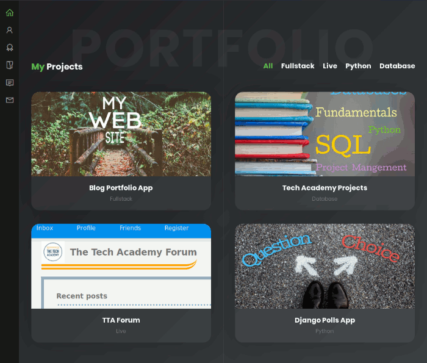

# Projects 

> An app to display your work as an index that lets viewers sort it by category.

## Project Requirements

1. The blog needs to be able to support doing a series of multiple posts within the same topic 
2. User should be able to sort all posts based on categories to find related information
3. Clicking a tag will show all tagged posts, and be more versatile than categories
4. Blog posts should be able to have as many pictures as the user wants
5. The date the blog was posted should be visibile with most recent posts appearing first
6. The blog posts should have a couple distinct content sections that can adjust text

### Functional Requirements:

  * Tree-like structure for blog indexes and posts 
    - All posts must be children of an index page
    - Index pages can be children of other index pages.
  * categories model will have a many-to-many relationship with pages
    - a category can be assigned to multiple posts
    - categories can be selected on index page and filter assigned posts
  * Tags will have their own index page 
    - tag index page will call a function to filter related tagged posts
    - tag index page will inherit the format of the blog index page
  * Blog pages will have a gallery images section 
    - images will be a foreign key to the default wagtail images gallery
    - images a main image function will designate the blogs thumbnail 
  * Index page will have a sort function for recent posts
    - date will be a mandatory field for creating blog page instantiations 
  * Blog pages will have 3 defined fields for text related content panels
    - Wagtail's RichText model will be used for body
    - intro will describe the post from the index page
    - blog page title will be its own field 
    
 ### Code Highlights
