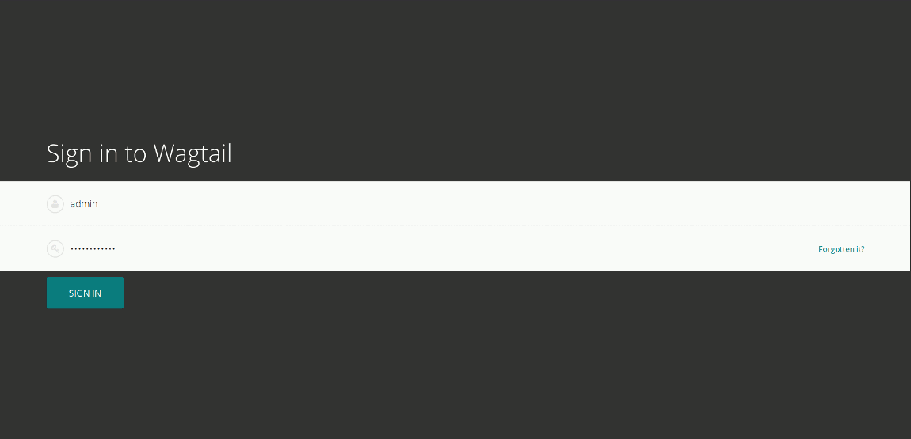
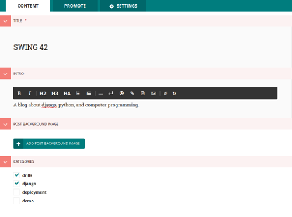
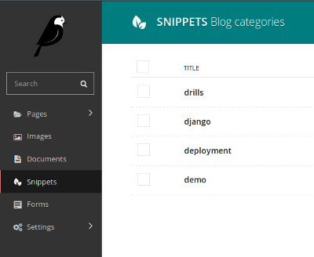
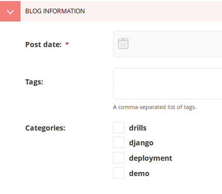
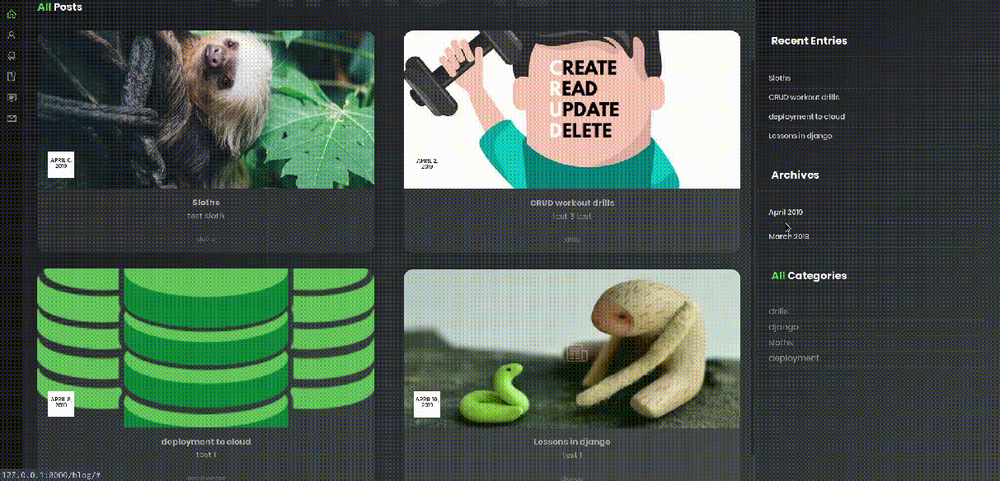

# Blog 

> A blog application with modern functionality adapted from the Wagtail documentation to fit within the scope of this project.

## Project Requirements

1. The blog needs to be able to support doing a series of multiple posts within the same topic 
2. User should be able to sort all posts based on categories to find related information
3. Clicking a tag will show all tagged posts, and be more versatile than categories
4. Blog posts should be able to have as many pictures as the user wants
5. The date the blog was posted should be visibile with most recent posts appearing first
6. The blog posts should have a couple distinct content sections that can adjust text

### Functional Requirements:

  * Tree-like structure for blog indexes and posts 
    - All posts must be children of an index page
    - Index pages can be children of other index pages.
  * categories model will have a many-to-many relationship with pages
    - a category can be assigned to multiple posts
    - categories can be selected on index page and filter assigned posts
  * Tags will have their own index page 
    - tag index page will call a function to filter related tagged posts
    - tag index page will inherit the format of the blog index page
  * Blog pages will have a gallery images section 
    - images will be a foreign key to the default wagtail images gallery
    - images a main image function will designate the blogs thumbnail 
  * Index page will have a sort function for recent posts
    - date will be a mandatory field for creating blog page instantiations 
  * Blog pages will have 3 defined fields for text related content panels
    - Wagtail's RichText model will be used for body
    - intro will describe the post from the index page
    - blog page title will be its own field 
    
 ### Code Highlights
 
With django, the developer only has to define one html template for a class object, and all instantiations created from this class will use it.

WIth Wagtail's Page model, the Blog Index Page class defines only 3 fields: intro, gallery_images, and categories.
```
class BlogIndexPage(Page):
    intro = RichTextField(blank=True)
    categories = ParentalManyToManyField('blog.BlogCategory', blank=True)

    content_panels = Page.content_panels + [
        FieldPanel('intro', classname="full"),
        InlinePanel('gallery_images', label="Post Background Image"),
        FieldPanel('categories', widget=forms.CheckboxSelectMultiple),
    ]
```

In the admin portal, this allows the user to create their blog's name, give it an image, and choose categories that will eventually be able to be sorted:




> If desired, a sub-index could be contained within the main blog that would be something like, "Django tutorial series", or "Hosting on a python paas."  You could still define categories and tags for each post, and they would still be contained within their respective index.


To make the posts sortable by category, categories have to be defined on both the blog index page, and the blog pages. The easiest way to do this is to use Wagtails snippet feature and let the user take care of this from within its own section of the portal, as such: 



```
@register_snippet
class BlogCategory(models.Model):
    name = models.CharField(max_length=255)
    icon = models.ForeignKey(
        'wagtailimages.Image', null=True, blank=True,
        on_delete=models.SET_NULL, related_name='+'
    )

    panels = [
        FieldPanel('name'),
        ImageChooserPanel('icon'),
    ]

    def __str__(self):
        return self.name
 ```
 
After declaring a relationship to categories from the blog page class, you will be able to select it when making a post from the admin portal.
 
Here is the code that defines the fields the user will see when making a post, with categories being at the bottom:
 ```
 class BlogPage(Page):
    date = models.DateField("Post date")
    intro = models.CharField(max_length=250)
    body = RichTextField(blank=True)
    tags = ClusterTaggableManager(through=BlogPageTag, blank=True)
    categories = ParentalManyToManyField('blog.BlogCategory', blank=True)
```
Then we just assign what kind of content panels you want to user to be able to select from:
```
content_panels = Page.content_panels + [
        MultiFieldPanel([
            FieldPanel('date'),
            FieldPanel('tags'),
            FieldPanel('categories', widget=forms.CheckboxSelectMultiple),
        ], heading="Blog information"),
```
This is what the end user sees:



If you will want to acutally be able to use the categories to find the blog posts you're looking for, we need to put them on the html page. 

From the Blog Index Page template, I created a categories section on the right hand panel and called all user selected categories to display with the following block of code:

```


<ul>
    
    <div class="f_btn">
        <li class="cat-item cat-item-2">
          <label><input type="radio" name="fl_radio" value="{{ category.name }}" />

            {{ category.name }}

          </label>
         </li>
    </div>
     
</ul>


```

Using the wagtail flavored Django template tag ```{{ category.name }}``` I was able to able pull all user defined categories from the database mapped to this page class object. With some clever pre-defined javascript, all grid items on the page with the same category beautifully filter when clicked. 

Here is an edited snippet of the code to make the user-defined category appear as a grid item:
```


 
<div class="col col-m-12 col-t-12 col-d-6 col-d-lg-6 grid-item {{ category.name }}">
```
**Now any one who visits the blog can filter posts by category on the blog index page.**




*For the code in full, checkout the [templates page](https://github.com/CreativeDave/Blog_Portfolio_App/tree/master/blog/templates/blog) in the Blog app directory.*


