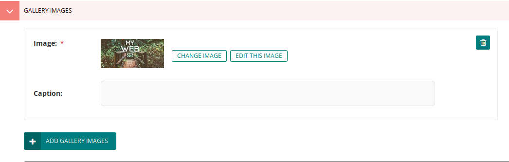
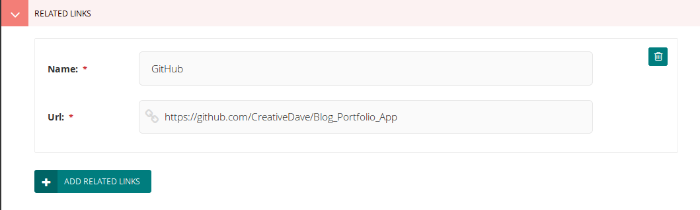

# Projects App

> An intuitive projects repository and showcase app, easily pluggable into any existing website. 

## Project Requirements

1. Portfolio page should include published works and be edited in admin section.
2. The overall design should be able to be used by anyone, regardless of programming experience.
3. There should be a way to view the projects overall information that the user can customize
4. Larger projects should be able to display all component parts easily
5. User should be able to post links for each section 
6. Projects should have a main image
7. Projects category should be sortable
8. Each project has a customizable intro, an outcome, and a description

### Functional Requirements:

  * Projects selected from project index page link to children pages 
    - The project index page defines function to display info of all direct children pages
    - The project page functions as index page, but links to urls defined in children pages from user admin 
    - main project description can be viewed through pop up on project page 
  * Categories selected on index page display on header and filter projects
    - project category class as register snippet mapped to project page and index page with many-to-many relationship
    - categories defined on index page will filter categories defined on project page as grid-items
  * Related links defines name and url object and maps to project page   
    - project page defines function to return name and url which can be called from template to link accordingly 
    - urls are selected in admin portal through inline panels 
  * User defines main image for project pages 
    - Project Index page defines main_image function which is called by templates of project pages 
  * User defines main image for project objects
    - Project page gallery image is foreign key to project page and is instantiated as object in content panels 
  * Project pages define 3 fields for user input
    - intro objects are standard django models and recieve data from user in field panel on project page 
    - Description is rich text field and apperas in pop up when overview link is selected
    - outcome is rich text field and appears as blockquote when overview link is selected 
    
 ### Code Highlights
 
The main feature of the projects section is being able to choose a featured project and see all related sub sections of the project in an index. When you click on a project from the project section of the site, you're not actually being routed to an index page, even though it seems like one. This has to do with how we call our page objects from the template:

 ```
div class="row grid-items">

 
  
 
 <!-- work item photo -->
 
 
 <div class="col col-m-12 col-t-6 col-d-6 col-d-lg-6 grid-item design">
     <div class="box-item card-box">
         <div class="image">
             <a href="{{ post.related_link }}" target="_blank" class="">
                 
                  <span class="info">
                     <span class="icon fa fa-gear"></span>
                 </span> 
             </a>
         </div>
         <div class="desc">
             <a href="{{ post.related_link }}" target="_blank" class="name ">{{ post.title }}</a>
             <div class="category">View on {{ post.related_link_name }}</div>
         </div>  
     </div>
 </div>
 
 
 
 
</div>

```

**For every section of a project a user creates, this code will repeat and populate objects on our site.**

It becomes very simple to add work to the portfolio. 

*How does it work?*

The first line, `````` calls a get-context function defined in our models and in\terates through it. From the ProjectPage class in models.py: 
```
    def get_context(self, request):
        context = super().get_context(request)
        projectsections = self.get_children().live()
        context['projectsections'] = projectsections
        return context
```
All 'children' of the project page are filtered (looking for published ones) and stored in a dictionary named projectsections. For example, on my website, the Project and Blog sections are actually children of the Blog Portfolio App. This was chosen in the admin portal, but really any page can be a child of any page in the wagtail tree structure.

``` ``` is template language unique to wagtail to specifiy the information we need is not part of the Page class, but instances of the models that inherit from it. Basically every piece of data we're requesting. 

```


 ```
The requirements specified that projects need to have a main image. After defining a ProjectPageGalleryImage class and mapping it to the project page so it can be selected in the panels, the following function defines which one should be the main image. logically, its the first.
 
 ```
     def main_image(self):
        gallery_item = self.gallery_images.first()
        if gallery_item:
            return gallery_item.image
        else:
            return None
```




 So we're returning the first specific image from the objects iterated through by 'post' in the dictionary projectsections and using a pythonic 'if'statement to drop it in our template. 
 
 ```
 <a href="{{ post.related_link }}" target="_blank" class="">
 
 ```
 
 I'll explain ```post.related link```, then come back to what the wagtail `````` tag means.
 
For requirement #5, users should be able to post links for each section. In models.py I define a RelatedLinks class and give it 3 fields, a parental key to ProjectPage, a name, and url:

 ```
 class ProjectPageRelatedLink(Orderable):
    page = ParentalKey(ProjectPage, on_delete=models.CASCADE,
                       related_name='related_links')
    name = models.CharField(max_length=255)
    url = models.URLField()

    panels = [
        FieldPanel('name'),
        FieldPanel('url'),
    ]
```

Now I can add it to the panels in ```ProjectPage``` and define functions which let us link to user-specified pages in the template. 

I'll explain.

First, here is what the related links panels look like in the code:
```
 InlinePanel('related_links', label="Related links"),
 InlinePanel('gallery_images', label="Gallery images"),
 ```
 and this is what it lets the user accomplish:
 
 
 
 When someone clicks on the link from the page howerver, it actually sends an http request to the link specifed by the user. How does django know which one? The following 2 functions tell it.
 
 ```
     def related_link(self):
        gallery_link = self.related_links.first()
        if gallery_link:
            return gallery_link.url
        else:
            return None

    def related_link_name(self):
        gallery_link = self.related_links.first()
        if gallery_link:
            return gallery_link.name
        else:
            return None
  ```
what ```post.related_link``` is actually saying is when the user enters a link from the admin panel, it instatiates a ProjectPageRelatedLink object (or tuple, as all classes become tables in the database) with the link as a record in the url field which gets called as 'post' iterates through a dictionary of all children pages looking for specific objects.  

Even though ProjectPageRelatedLink is not a child page, it is related through a parental key relationship and part of the definition of the content_panels object which lets the user insert information into it. 

The `````` is a simple way to call the main_image function. I'm defining the size of the image here, so the user only needs to worry about which one to choose, not how it's supposed to fit on the page. 

*Theres much more code which went into making this page, which you can view [here](https://github.com/CreativeDave/Blog_Portfolio_App/tree/master/project/templates/project). The main takeaway is how simple it is to add project after project from the backend interface without having to code anymore thanks to django and wagtail's intuitive template tags and object instantiation.* 
